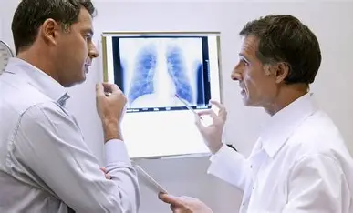

# 🔹 1. Adquisición del Conocimiento

📌 Qué ocurre aquí:
En esta etapa, el conocimiento se obtiene de diferentes fuentes: expertos humanos (médicos especialistas), sensores (equipos médicos, laboratorios), y bases de datos clínicas. Este conocimiento es recopilado por el ingeniero del conocimiento y se traduce en un lenguaje formal para que la máquina pueda procesarlo.

📌 Ejemplo aplicado:

- El experto médico (neumólogo) le explica al ingeniero del conocimiento cómo diagnostica la neumonía:
    - “Si un paciente presenta fiebre mayor a 38.5°C, dificultad respiratoria, dolor en el pecho y tos con flemas, existe una alta probabilidad de neumonía”.
- También se extraen protocolos médicos de guías clínicas, como la OMS.
- Los sensores médicos (termómetro digital, oxímetro, rayos X, análisis de laboratorio) aportan datos objetivos del paciente.
- El ingeniero del conocimiento organiza esta información en reglas y criterios claros.

## 👉 Resultado: 
Se construye un conjunto de reglas diagnósticas y criterios clínicos listos para pasar a la base de conocimiento.

